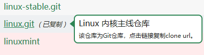

本镜像站中，以`.git`结尾的为`Git`仓库镜像。在镜像站首页点击相应的链接，即可复制克隆链接。

以`Linux`内核主线仓库为例，使用方法如下图所示：

点击对应链接复制克隆链接，然后使用`Git`客户端克隆代码。



```bash varcode
git clone ${_http}://${_domain}/git/linux.git
```

**注意**, `Git`仓库镜像和普通镜像之间有如下区别：

- 该URL在浏览器打开后，展示页面非仓库内容
- 只能使用`Git`客户端克隆
- 暂时不支持`git`协议
